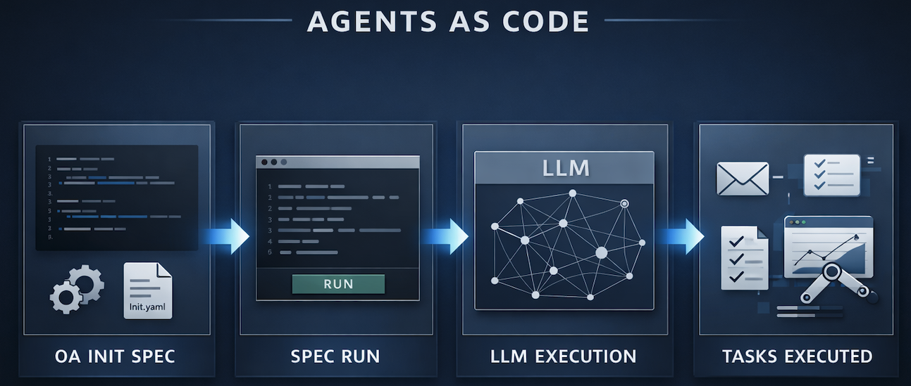

# Open Agent Spec (OA)

Define AI agents as contracts, not scattered prompts.


Open Agent Spec lets you define an agent once in YAML, validate inputs and outputs against a schema, and either run it directly with `oa run` or generate a Python scaffold with `oa init`.

## Why This Exists

Most agent systems are hard to reason about:
- outputs are not strictly typed
- behaviour is buried in prompts
- logic is split across Python, Markdown, and framework abstractions
- swapping models often breaks things in subtle ways

## The Idea

Open Agent Spec treats an agent like infrastructure.

Think OpenAPI or Terraform, but for AI agents.

You define:
- input schema
- output schema
- prompts
- model configuration

Then OA enforces the boundary:

`input -> LLM -> validated output`

If the output does not match schema, the task fails fast with a validation error.

For example, this shape mismatch can silently break downstream systems:

```json
{"msg":"hello"}
```

instead of:

```json
{"response":"hello"}
```



## Super Quick Start

Install (Python 3.10+):

```bash
pipx install open-agent-spec
```

```bash
oa init aac
oa validate aac
export OPENAI_API_KEY=your_key_here
oa run --spec .agents/example.yaml --task greet --input '{"name":"Alice"}' --quiet
```

With OA you can:
- define tasks, prompts, model config, and expected I/O in YAML
- run a spec directly without generating code first
- keep `.agents/*.yaml` in your repo and call them from CI
- generate a Python project scaffold when you want to customize implementation

## First Run

Shortest path from install to a working agent:

**1. Create the agents-as-code layout** (`aac` = repo-native `.agents/` directory):

```bash
oa init aac
```

This creates:

```text
.agents/
├── example.yaml   # minimal hello-world spec
├── review.yaml    # code-review agent that accepts a diff file
├── change.diff    # sample diff for immediate review-agent testing
└── README.md      # quick usage notes
```

**2. Validate the generated specs:**

```bash
oa validate aac
```

**3. Set an API key** for the engine in your spec (OpenAI by default):

```bash
export OPENAI_API_KEY=your_key_here
```

**4. Run the example agent:**

```bash
oa run --spec .agents/example.yaml --task greet --input '{"name":"Alice"}' --quiet
```

`--quiet` prints the task output JSON only, good for piping to `jq` or scripting:

```json
{
  "response": "Hello Alice!"
}
```

Omit `--quiet` for the full execution envelope with Rich formatting.

**5. Run the review agent with the bundled sample diff:**

```bash
oa run --spec .agents/review.yaml --task review --input .agents/change.diff --quiet
```

Or review your own change:

```bash
git diff > change.diff
oa run --spec .agents/review.yaml --task review --input change.diff --quiet
```

## Write Your Own Spec

Start from this shape:

```yaml
open_agent_spec: "1.4.0"

agent:
  name: hello-world-agent
  role: chat

intelligence:
  type: llm
  engine: openai
  model: gpt-4o

tasks:
  greet:
    description: Say hello to someone
    input:
      type: object
      properties:
        name:
          type: string
      required: [name]
    output:
      type: object
      properties:
        response:
          type: string
      required: [response]

prompts:
  system: >
    You greet people by name.
  user: "{{ name }}"
```

Validate first, then run:

```bash
oa validate --spec agent.yaml
oa run --spec agent.yaml --task greet --input '{"name":"Alice"}' --quiet
```

## Generate a Python Scaffold

If you want editable generated code instead of running the YAML directly:

```bash
oa init --spec agent.yaml --output ./agent
```

Generated structure:

```text
agent/
├── agent.py
├── models.py
├── prompts/
├── requirements.txt
├── .env.example
└── README.md
```

## Core Idea

Most agent projects end up hand-rolling the same pieces:
- prompt templates
- model configuration
- task definitions
- routing glue
- runtime wrappers

OA moves those concerns into a declarative spec so they can be reviewed, versioned, and reused.

The intended model is:
- spec defines the agent contract
- `oa run` executes the spec directly
- `oa init` generates a starting implementation when you need code
- external systems can orchestrate multiple specs however they want

OA deliberately does not prescribe:
- orchestration
- evaluation
- governance
- long-running runtime architecture

## Common Commands

| Command | Purpose |
|--------|--------|
| `oa init aac` | Create `.agents/` with starter specs |
| `oa validate aac` | Validate all specs in `.agents/` |
| `oa validate --spec agent.yaml` | Validate one spec |
| `oa test agent.test.yaml` | Run YAML eval cases (model + assertions on task output); `--quiet` for CI JSON |
| `oa run --spec agent.yaml --task greet --input '{"name":"Alice"}' --quiet` | Run one task directly from YAML |
| `oa init --spec agent.yaml --output ./agent` | Generate a Python scaffold |
| `oa update --spec agent.yaml --output ./agent` | Regenerate an existing scaffold |

## More Detail

| Resource | Contents |
|----------|----------|
| [openagentspec.dev](https://www.openagentspec.dev/) | Project website |
| [docs/REFERENCE.md](https://github.com/prime-vector/open-agent-spec/blob/main/docs/REFERENCE.md) | Spec structure, engines, templates, `.agents/` usage |
| [examples/multi-agent](https://github.com/prime-vector/open-agent-spec/tree/main/examples/multi-agent) | Multi-agent orchestration example — manager, workers, task board, dashboard |
| [Repository](https://github.com/prime-vector/open-agent-spec) | Source, issues, workflows |

## Notes

- The CLI command is `oa` (not `oas`).
- Python 3.10+ is required.
- `oa run` requires the relevant provider API key for the engine in your spec.

## About
- OA Open Agent Spec was dreamed up by Andrew Whitehouse in late 2024, with a desire to give structure and standardiasation to early agent systems
- In early 2025 Prime Vector was formed taking over the public facing project

## License

MIT | see [LICENSE](LICENSE).

[Open Agent Stack](https://www.openagentstack.ai)
